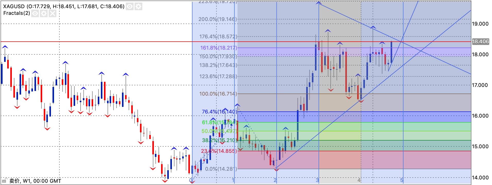
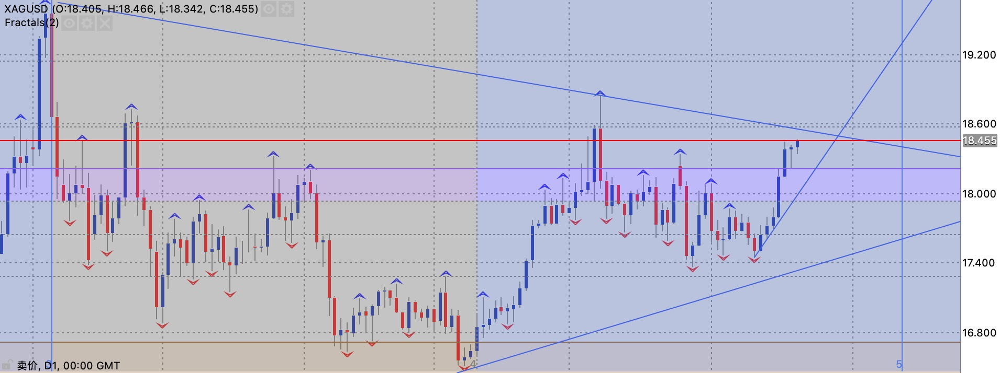

从2008年买黄金白银，到现在主要做白银TD，也有十几年了。
可以说亏到2018年，好歹把亏损抹平了。但是自己犯贱，找了个高手指导，一下子亏损又比之前的更多。到现在还是慢慢填坑路。

到现在还没有一个系统的可以操作的思路，还是野路子。

有一个初步的想法，就是裸k交易。如何确定方向与震荡是一个亘古不变的难题。
简单来说就是每次收盘价格的实体低点的趋势是如何的。所以确定观察周期是非常重要的。

自己总结的经验如下：

需要勤画趋势线，周线的趋势线来确定大的框架，日线的趋势线来确定一个方向，4H趋势线来确定入场时机。
突破趋势线是否下单的依据是日线方向。

下单之后的策略也很关键：

1. 突破趋势线之后，支撑的震荡区域是在哪里？
2. 突破趋势线之后是立即下单还是等回撤之后再下单？
3. 什么时候止盈？
4. 止盈也是突破趋势线吗？

比如下图，如何确定后续走势？

1. 看上去是受18.5的周线下降趋势线压制，所以这里是否突破还是震荡还不确定。
2. 可以确定的是现在的行情属于上升趋势，趋势没有改变。
3. 看上去震荡区间已经缩小，随时会有一波周线级别的行情。
4. 如果突破不了，什么时候止盈？跌破4H趋势线止盈？在支撑趋势线接回？

观察下看看
